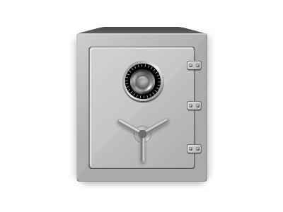

# Safe

</a>

Safe is a meta backup program that manages other backup programs to ensure data
is backed up according to the LOCKSS philosophy: Lots of Copies Keeps Stuff
Safe.

For example, if you want to backup to Dropbox and S3 using Restic and
Hashbackup, Safe will take care of managing those other programs to ensure that
everything is backed up independently.

## Features

- Runs backups on a user-defined schedule
- Manages multiple backup programs (restic, hashbackup, ...)
- Manages multiple backup destinations (dropbox, s3, ...)
- Enables the highest available encryption level of the underlying backup
  program
- Automatically verifies backup data on a schedule
- All configuration and settings stored in git for revision control and
  disaster recovery
- Ability to create a USB recovery drive with everything needed to do a "cold
  restore"
- Ability to backup essential information to paper copy

## Philosophies

- Use diversity of implementation. Don't rely on any single entity.
  - For the program used to back up the data, use multiple different backup
    programs.
  - For the providers used to store the data, use multiple different storage
    providers.
